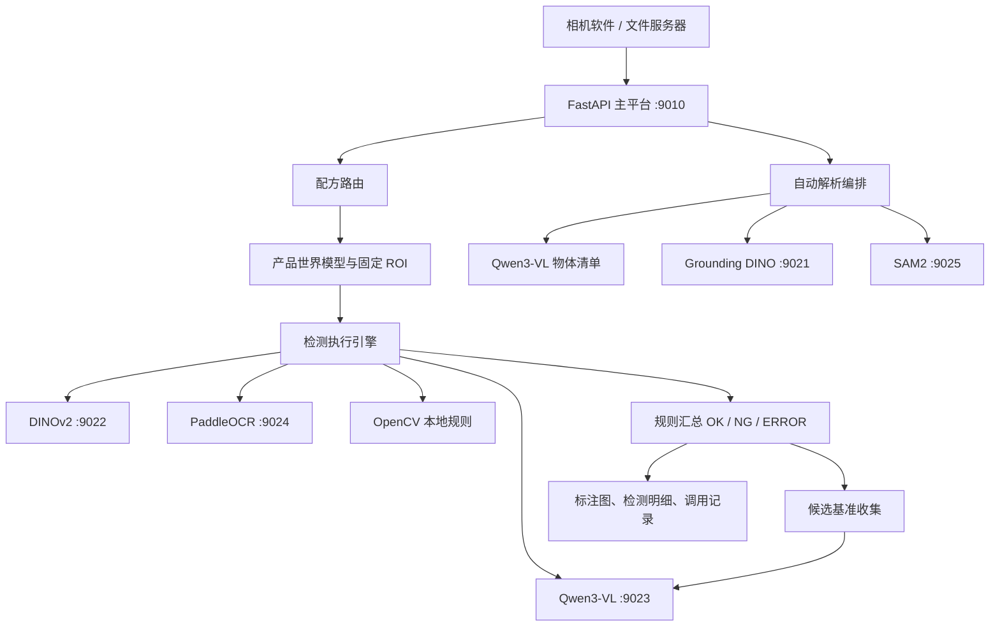

# Vision Platform 工业视觉智能平台系统交接手册

> 文档版本：V1.0  
> 对应代码分支：`develop`  
> 编制日期：2026-08-16  
> 适用对象：后端开发、算法工程师、前端开发、实施运维人员、项目负责人

## 1. 文档目的

本文用于完整交接当前 Vision Platform 的业务目标、系统架构、已实现功能、关键代码、模型服务、数据库结构、检测流程、接口协议、部署方式、测试方法和已知风险。接手人员应先阅读本文，再阅读根目录 `README.md` 和 `docs/Vision-Platform-Operation-SOP.docx`。

当前系统定位不是单一模型演示，而是一个面向汽车电子装配错装、漏装、混装场景的工业视觉检测平台。平台借鉴自动驾驶“感知层—场景模型—状态理解—决策”的分层思想，同时保留工业现场必需的配方路由、固定 ROI、确定性规则和结果追溯。

## 2. 当前建设范围

### 2.1 已覆盖场景

- 固定工位、固定相机、固定曝光、固定拍照位置。
- 相机软件先将图片上传到文件服务器，再调用平台检测接口。
- 一次请求可包含多张图片。
- 配方按拉线、物料、工序、相机、拍照次数匹配。
- 检测类型目前收敛为三类：物体存在、OCR 文字、颜色。
- 可选启用 VLM 复核，并同时展示主模型与 VLM 的输出。
- 生产检测完成后，可自动收集合格候选 ROI，使用基准图与实测图进行 VLM 双图校验。

### 2.2 暂未作为生产能力覆盖

- 划痕、污渍、裂纹等表面缺陷。
- 相机、运动轴、光源和 PLC 的直接控制。
- 训练专用 YOLO 或分类模型的完整 MLOps 流程。
- 多 GPU 调度、跨服务器任务队列和高可用集群。
- 自动标定和工件大范围位置漂移补偿。

## 3. 总体架构



系统由一个业务平台进程和五个算法服务组成。业务平台只面向“能力”调用，不把配方永久绑定到某个具体模型实现。当前本地测试仍采用单机 HTTP 服务，端口和模型如下。

| 端口 | 服务 | 当前模型/实现 | 主要职责 |
|---:|---|---|---|
| 9010 | Vision Platform | FastAPI | 配方、ROI、检测执行、规则、记录、服务管理 |
| 9021 | Grounding DINO | grounding-dino-base | 开放词汇定位、自动解析候选框 |
| 9022 | DINOv2 | dinov2-base | ROI 特征提取与参考图相似度 |
| 9023 | Qwen3-VL | Qwen3-VL-4B-Instruct 4-bit | 物体清单、规则复核、双图校验 |
| 9024 | PaddleOCR | PP-OCRv5 mobile | 专用 OCR 文字识别 |
| 9025 | SAM2 | sam2.1-hiera-small | 线束像素级分割 |

## 4. 关键设计原则

1. **配方决定检查什么。** AI 不负责猜测当前工位的全部质量要求。
2. **固定 ROI 是生产执行主路径。** 自动解析只负责配置辅助，候选框必须由用户确认或修改。
3. **主模型与规则优先。** VLM 用于复杂复核和双图辅助判断，不作为全部检测项的唯一判定来源。
4. **接口状态和质量结果分离。** `code` 表示接口执行是否成功，`result` 表示产品为 `OK`、`NG` 或 `ERROR`。
5. **安全降级。** 模型异常、输出无法解析或 VLM 返回不确定时，不自动判为 OK。
6. **模型服务独立。** 单个模型服务可单独启动、停止、查看健康状态和日志。
7. **保留可追溯证据。** 检测任务、单项结果、ROI 图、标注图、主模型输出和 VLM 输出均可追溯。

## 5. 用户界面功能

工作台地址为 `http://127.0.0.1:9010/workspace`。

### 5.1 配置编辑

- 填写拉线、物料、工序、相机、拍照次数和版本。
- 自动生成配方编码和名称。
- 上传产品图片；上传后不会立即自动解析。
- 支持滚轮以鼠标位置为中心缩放、空格拖动和双击复原。
- 支持手动画矩形 ROI。
- 点击“自动解析”后，Qwen3-VL 生成物体清单，Grounding DINO 定位候选框，线束场景可调用 SAM2。
- AI 候选框可确认、移动、缩放、删除；确认后才生成正式 ROI。
- ROI 配置弹窗中仅配置存在、颜色、OCR 三类规则。
- 可勾选 VLM 结果复核，并自动根据对象类型和规则生成提示词。
- “测试当前 ROI”在当前页面下方显示标准 ROI 图、实测 ROI 图、规则、主模型结果、VLM 结果和最终结果。
- 保存 ROI 后同步更新该 ROI 的基准裁剪图和 DINOv2 特征。

### 5.2 视觉库

- 按名称、编码、拉线、物料、工序、相机和状态筛选配方。
- 查看配方摘要、测试配方或重新打开编辑。
- 当前保存即发布，生产接口只匹配 `PUBLISHED` 配方。

### 5.3 候选基准

- 原“标准图库”用户菜单已移除。
- 该页面只展示系统从生产检测中自动收集的候选 ROI。
- 页面同时显示当前合格基准图和本次实测 ROI。
- 显示主模型相似度、图片质量、VLM 双图结论和 VLM 置信度。
- 用户可拒绝候选图或将其加入合格基准。
- 后端仍保留参考组、参考图和对象类型数据表，因为存在检测、ROI 基准和候选提升逻辑仍依赖这些内部数据；不要直接删除这些表。

### 5.4 检测记录

- 记录第三方调用时间、调用方 IP、产品条码、接口状态、检测结果和耗时。
- 保存请求参数和完整响应。
- 响应明细包含检测区域名称、规则、主模型输出、VLM 输出和最终结论。

### 5.5 模型服务

- 统一显示五个模型服务的 IP、端口、运行状态、进程号和设备信息。
- 支持一键启动、一键停止和刷新状态。
- 支持查看启动日志、错误日志和调用日志。
- 日志区域可滚动并自动定位到最新内容。
- 已修复残留 PID 导致“已停止服务误显示为启动失败”的问题。

## 6. 配方系统

### 6.1 配方业务键

配方由以下五个字段决定生产场景：

```text
line_code + material_code + process_code + camera_code + capture_index
```

推荐编码：

```text
{LINE}_{MATERIAL}_{PROCESS}_{CAMERA}_P{CAPTURE_INDEX}
```

例如：

```text
LINE01_MAT001_OP20_CAMERA1_P1
```

数据库通过业务键索引加速匹配。生产接口只匹配已发布配方，避免草稿或历史配置被误用。

### 6.2 配方匹配优先级

1. 接口显式参数：拉线、物料、工序、相机、拍照次数。
2. 接口提供拉线、物料、工序，平台从图片名解析 `CAMERA数字PICTURE数字`。
3. 没有结构化参数时，根据配方编码或业务签名匹配图片名。
4. 找不到唯一已发布配方时返回错误，不使用模糊默认配方。

### 6.3 图片名解析

图片名示例：

```text
ASSY-CAMERA1PICTURE1.png
```

解析结果：

```text
camera = CAMERA1
picture = 1
```

## 7. 产品世界模型

产品世界模型借鉴自动驾驶场景模型思想，用于描述“当前产品在某个视角中应该有哪些对象、对象位于哪里、期望状态是什么”。当前实现仍以固定 ROI 为确定性执行区域。

核心关系：

```text
ProductScene
  -> SceneObject
       -> 多视角坐标 CAMERA:Pnn
       -> expected_state
       -> perception_capabilities
  -> ObjectRelation
```

配方 ROI 保存后会同步到对应产品场景对象。对象可保留类型、名称、期望状态、相机视角坐标和检测能力。后续如接入多相机融合或对象关系判断，可在这一层扩展，而无需改变外部检测接口。

## 8. ROI 与规则实现

### 8.1 ROI 坐标

- 前端画布使用原图坐标与显示缩放比例换算。
- 后端同时保存绝对坐标和归一化比例。
- 检测时按原图读取配方 ROI 并裁剪。
- ROI 修改后，标准参考裁剪图需要重新生成，避免标准图仍使用旧坐标。

### 8.2 物体存在

执行能力：`REFERENCE_SIMILARITY`  
主模型：DINOv2

流程：

```text
实测 ROI -> DINOv2 embedding
参考 ROI -> 预生成或实时 embedding
余弦相似度 -> Top-K
相似度与阈值比较 -> OK / NG
可选 VLM 复核
```

当前存在检测依赖至少一张可用参考 ROI。DINOv2 本身不是检测器，它输出视觉特征；真正的判定由相似度和规则阈值完成。

标准图 Embedding 在基准创建时预先生成并以 FP16 保存。生产检测只对本次实测 ROI 提取一次 Embedding，然后在平台内与当前 ROI 的已保存向量计算相似度；只有旧基准缺少可用 Embedding 时才回退到重新编码标准图片。

### 8.3 OCR 文字

执行能力：`OCR_TEXT`  
主模型：PaddleOCR

流程：

```text
ROI -> PaddleOCR -> 文本与置信度
文本标准化 -> CONTAINS 等规则
规则结果 -> OK / NG
可选 VLM 复核
```

OCR 使用专用模型，不默认使用 Qwen3-VL 识字。这样延迟更低，结果更容易解释。

### 8.4 颜色

执行能力：`COLOR_RATIO`  
主实现：OpenCV

流程：

```text
ROI -> HSV/Lab 分析 -> 主色与颜色比例
颜色范围及最小比例规则 -> OK / NG
可选 VLM 复核
```

创建颜色规则时，平台可先从当前 ROI 自动识别主色并回填校验值，降低普通用户填写颜色名称产生的偏差。

## 9. VLM 复核策略

Qwen3-VL 只启动一个模型服务进程，模型只加载一次。以下能力共享同一个端口 `9023`、同一份显存和同一个推理锁：

- `/v1/judge`：单张 ROI 规则复核。
- `/v1/compare`：基准图与候选图双图校验。
- `/v1/inventory`：整图物体清单解析。
- `/v1/discover`：候选物体发现兼容接口。

共享模型可减少显存和服务数量，但当前推理锁会使请求串行。生产并发提高后，候选双图复核可能排队影响在线 VLM 复核，建议增加优先级队列：在线检测高优先级，候选收集低优先级。

### 9.1 每次检测都复核

- 每次调用 VLM。
- 不显示也不参考复核上下限。
- 最终策略由主结果和 VLM 结果融合。

### 9.2 仅低置信度复核

- 分数低于下限：直接 NG。
- 分数位于上下限之间：调用 VLM。
- 分数高于上限：采用主模型结果。
- 当前 ROI 测试为便于比较，在启用复核后强制执行 VLM。

### 9.3 不确定和异常处理

- VLM 返回 `UNCERTAIN`：按 NG 安全降级。
- VLM 输出不是合法结构化结果：按配置的安全结果处理。
- VLM 服务不可用：生产任务不得伪装成产品 NG，应返回 ERROR 或按明确的设备异常策略处理。

## 10. 自动解析实现

自动解析只在用户点击按钮后执行，不在上传图片时自动运行。

```text
上传整图
-> Qwen3-VL 生成物体种类、数量和英文定位提示
-> Grounding DINO 根据英文提示定位框
-> 针对螺钉和线束追加专用提示模板
-> 线束粗框交给 SAM2 生成掩码
-> 与 OpenCV 橙色 HSV 分割结果融合
-> 前端显示 AI 候选框/掩码
-> 用户确认、调整或删除
-> 生成正式 ROI
```

Grounding DINO 对企业内部中文名称不稳定，因此平台内部把常用类型转换为英文提示词。普通用户只看到“保险丝、螺丝、连接器、线束”等中文对象类型，不需要理解模型提示词。

自动解析的定位质量仍受模型开放词汇能力限制。生产判定不直接依赖自动解析结果，而依赖用户确认后的固定 ROI。

## 11. 候选基准自动收集

候选收集在生产接口响应后作为后台任务执行，不阻塞相机软件获取检测结果。

进入候选流程的条件：

1. 整个检测任务结果为 OK。
2. ROI 下所有硬规则均通过。
3. 必须存在 DINOv2 相似度规则。
4. 相似度达到系统候选阈值，默认 `0.93`。
5. ROI 图片清晰度、亮度和尺寸质量检查通过。
6. 感知哈希判定不是重复图片。

校验流程：

```text
已批准合格基准图 + 本次实测 ROI
-> Qwen3-VL /v1/compare
-> PASS / REJECT / UNCERTAIN
-> 候选基准页面
-> 用户拒绝或加入合格基准
```

每个 ROI 默认最多保留 20 张活动候选图，超出后旧候选软删除。候选图不会未经确认直接污染正式基准。

正式基准默认最多保留 10 张。用户批准候选图时，平台先比较已保存 Embedding：近重复图片不追加；未达上限时直接加入；达到上限后，只有候选图确实增加正常外观多样性时才软停用一张高度重复旧基准。旧图片和历史记录不物理删除。

## 12. 检测执行流程

```text
接收 sn 与 image_paths
-> 按参数或图片名匹配已发布配方
-> 创建 DetectionTask
-> 逐张读取图片
-> 逐 ROI 裁剪
-> 按检测项调用 DINOv2 / OCR / OpenCV
-> 根据复核策略调用 Qwen3-VL
-> 汇总检测项 -> ROI -> 单图 -> 产品
-> 生成整图标注结果
-> 保存 DetectionItemResult
-> 返回兼容接口结果
-> 后台收集候选基准图
```

当前执行引擎对图片和 ROI 采用顺序循环。多类规则仍可进一步优化为按能力分组并行或批处理，例如同一图片的 OCR 与 DINOv2 并行、多个 DINOv2 ROI 批量提取特征。

## 13. 对外接口

### 13.1 供应商兼容接口

```http
POST /api/detect
Content-Type: application/json
```

请求示例：

```json
{
  "sn": "SN202608160001",
  "line": "LINE01",
  "materialcode": "MAT001",
  "operation": "OP20",
  "camera": "CAMERA1",
  "picture": 1,
  "image_paths": [
    "C:/vision-images/ASSY-CAMERA1PICTURE1.png"
  ]
}
```

其中 `camera` 和 `picture` 可省略，平台从图片名解析。兼容别名包括 `line_code`、`material_code`、`process_code`、`camera_code` 和 `capture_index`。

响应顶层协议保持不变：

```json
{
  "code": 0,
  "message": "success",
  "result": "OK",
  "image_paths": [".../result_1.jpg"],
  "inspection_results": []
}
```

`inspection_results` 为新增详细字段，供应商旧程序可忽略。该字段返回检测区域名称和规则明细，不需要向外部返回 ROI 坐标。

### 13.2 内部检测接口

- `POST /api/v1/inspection/test`：测试单个 ROI 或整套配方，可使用未保存规则。
- `POST /api/v1/inspection/execute`：按配方编码、产品和工位执行。
- `GET /api/v1/inspection/history`：任务历史。
- `GET /api/v1/inspection/call-records`：第三方调用记录。

### 13.3 配置接口

- 产品、工位、配方 CRUD。
- 配方图片上传。
- ROI 创建、更新、删除、重新截取参考图。
- 检测项保存和删除。
- 配方发布和导出。

### 13.4 模型服务接口

- `GET /api/v1/model-services`：状态汇总。
- `POST /api/v1/model-services/{code}/start`：启动。
- `POST /api/v1/model-services/{code}/stop`：停止。
- `GET /api/v1/model-services/{code}/logs`：查看日志。

## 14. 数据库结构

当前使用 SQLite，默认文件为 `data/vision_platform.db`。生产多实例部署应迁移到 PostgreSQL。

| 模块 | 表/模型 | 作用 |
|---|---|---|
| 基础资料 | Product、Station | 产品和工位信息 |
| 配方 | Recipe | 配方业务键、版本、状态和底图 |
| ROI | RegionOfInterest | 区域坐标、对象类型、参考组、世界对象关联 |
| 检测项 | InspectionItem | 能力、期望值、规则、复核策略 |
| 检测任务 | DetectionTask | 一次执行的总状态和图片 |
| 接口记录 | DetectionApiCall | 第三方请求、响应、调用方和耗时 |
| 单项结果 | DetectionItemResult | 每条规则的实际值、分数、图片和消息 |
| 内部基准 | ReferenceObjectType、ReferenceGroup、ReferenceImage | ROI 基准和 DINOv2 参考图；无独立用户菜单 |
| 候选基准 | ReferenceCandidate | 自动收集、双图复核、提升和保留策略 |
| 世界模型 | ProductScene、SceneObject、ObjectRelation | 产品对象、视角位置和关系 |
| 模型注册 | ModelRegistry | 模型能力、运行时、地址和角色 |

数据库初始化在应用启动时执行。`app/db/init_db.py` 包含轻量 SQLite 字段升级和默认对象类型、模型注册数据写入。当前不是 Alembic 正式迁移体系；修改生产数据库前必须先备份。

## 15. 代码目录

```text
app/
  api/routes/              API 路由
  core/config.py           环境变量与端口配置
  db/                      SQLAlchemy 会话、初始化、轻量升级
  models/                  ORM 数据模型
  services/                检测、算法调用、候选收集、世界模型
  static/                  前端 CSS 与 JavaScript
  templates/               Jinja2 页面
dinov2_service/            DINOv2 服务
grounding_service/         Grounding DINO 服务
ocr_service/               PaddleOCR 服务
qwen_vl_service/           Qwen3-VL 多能力服务
sam2_service/              SAM2 服务
scripts/                   初始化、启动、下载、测试、模型恢复
tests/                     单元测试
vision-models/             本地模型权重
uploads/                   配方图、参考图、测试图、候选图
detection_results/         ROI 裁剪图和标注结果
data/                      SQLite 与模型服务 PID
logs/                      平台及模型服务日志
docs/                      SOP 与本文档
```

## 16. 配置项

配置文件为 `.env`，模板为 `.env.example`。重点参数：

| 参数 | 默认值 | 说明 |
|---|---:|---|
| APP_PORT | 9010 | 主平台端口 |
| GROUNDING_SERVICE_URL | 9021 | Grounding DINO 地址 |
| DINOV2_SERVICE_URL | 9022 | DINOv2 地址 |
| QWEN_VL_SERVICE_URL | 9023 | Qwen3-VL 地址 |
| PADDLEOCR_SERVICE_URL | 9024 | OCR 地址 |
| SAM2_SERVICE_URL | 9025 | SAM2 地址 |
| ALGORITHM_TIMEOUT_SECONDS | 15 | 算法调用超时 |
| REFERENCE_CANDIDATE_COLLECTION_ENABLED | true | 候选收集开关 |
| REFERENCE_CANDIDATE_SIMILARITY_THRESHOLD | 0.93 | 候选相似度门槛 |
| REFERENCE_CANDIDATE_VLM_CONFIDENCE_THRESHOLD | 0.90 | 双图复核置信度门槛 |
| REFERENCE_CANDIDATE_LIMIT_PER_ROI | 20 | 每个 ROI 活动候选上限 |

## 17. Windows 本地启动

```powershell
cd C:\Users\Administrator\Desktop\vision-platform
Copy-Item .env.example .env
.\start.ps1
```

模型服务可从工作台“模型服务”菜单启动，也可分别运行：

```powershell
.\.venv-qwen\Scripts\python.exe scripts\run_grounding.py
.\.venv\Scripts\python.exe scripts\run_dinov2.py
.\.venv-qwen\Scripts\python.exe scripts\run_qwen_vl.py
.\ocr_service\.venv\Scripts\python.exe scripts\run_ocr.py
.\.venv\Scripts\python.exe scripts\run_sam2.py
```

健康检查：

```text
http://127.0.0.1:9010/api/v1/health
http://127.0.0.1:9021/health
http://127.0.0.1:9022/health
http://127.0.0.1:9023/health
http://127.0.0.1:9024/health
http://127.0.0.1:9025/health
```

## 18. Linux / Red Hat 8.3 部署注意事项

- 使用 Python 3.11，避免依赖系统 Python。
- NVIDIA 驱动、CUDA 和 PyTorch 版本必须匹配服务器 GPU。
- `.venv`、`.venv-qwen` 和 `ocr_service/.venv` 不能从 Windows 复制，必须在 Linux 重建。
- Windows 路径必须改为 Linux 挂载路径，例如 `/data/vision-images`。
- 推荐用 systemd 分别守护主平台和五个模型服务。
- 单 GPU 环境需要明确显存预算；Qwen3-VL 使用 4-bit，SAM2 可先使用 CPU。
- SQLite 只适合单进程或低并发验证。正式多工位部署建议 PostgreSQL。
- 文件目录要设置服务账号读写权限，尤其是 `uploads`、`detection_results`、`data` 和 `logs`。
- SELinux 开启时，需要为端口和共享图片目录设置正确策略。

## 19. 测试与验收

运行全部单元测试：

```powershell
.\.venv\Scripts\python.exe -m unittest discover -s tests -p "test_*.py"
```

当前测试共 47 项，覆盖：

- 文件名与配方路由。
- 公开接口参数兼容。
- 世界模型与 ROI 同步。
- Qwen3-VL JSON 解析。
- VLM 复核策略。
- 颜色识别。
- 线束分割候选融合。
- 参考图更新。
- 候选基准判定和保留策略。

接口联调脚本：

```powershell
.\.venv\Scripts\python.exe scripts\test_detect.py `
  --line LINE01 `
  --materialcode MAT001 `
  --operation OP20
```

## 20. Git 与模型文件交付

源代码仓库：`https://github.com/LLLLLLLLai/vision-platform.git`，当前开发分支为 `develop`。

模型权重总量约 10.5GB，且 Qwen 权重中存在约 4.63GB 的单文件。模型权重不上传 GitHub，仓库只保存代码、模型标识、下载脚本、配置和目录说明。接手人员克隆代码后必须从下表官方来源下载，并放入指定本地目录。

| 模型 | 官方模型标识/下载链接 | 本地目录 | 下载方式 |
|---|---|---|---|
| DINOv2 Base | [facebook/dinov2-base](https://huggingface.co/facebook/dinov2-base) | `vision-models/dinov2-base` | `.venv/Scripts/python.exe scripts/download_dinov2.py` |
| Grounding DINO Base | [IDEA-Research/grounding-dino-base](https://huggingface.co/IDEA-Research/grounding-dino-base) | `vision-models/grounding-dino-base` | `.venv/Scripts/python.exe scripts/download_grounding.py`，也可使用 `.venv-qwen` |
| Qwen3-VL-4B-Instruct | [Qwen/Qwen3-VL-4B-Instruct](https://huggingface.co/Qwen/Qwen3-VL-4B-Instruct) | `vision-models/qwen3-vl-4b-instruct` | `.venv-qwen/Scripts/python.exe scripts/download_qwen_vl.py`；默认 ModelScope，可用 `--source huggingface` |
| SAM2.1 Hiera Small | [facebookresearch/sam2](https://github.com/facebookresearch/sam2)；[官方权重直链](https://dl.fbaipublicfiles.com/segment_anything_2/092824/sam2.1_hiera_small.pt) | `vision-models/sam2.1-hiera-small` | 下载 `sam2.1_hiera_small.pt` 并保留配置文件 |
| PP-OCRv5 Mobile | [PaddleOCR 官方仓库](https://github.com/PaddlePaddle/PaddleOCR)；[OCR 模型文档](https://github.com/PaddlePaddle/PaddleOCR/blob/main/docs/version3.x/pipeline_usage/OCR.en.md) | PaddleX/PaddleOCR 默认缓存目录 | 首次启动 OCR 服务时由 `PaddleOCR` 自动下载 `PP-OCRv5_mobile_det` 和 `PP-OCRv5_mobile_rec` |

Windows 下载示例：

```powershell
.\.venv\Scripts\python.exe scripts\download_dinov2.py
.\.venv-qwen\Scripts\python.exe scripts\download_grounding.py
.\.venv-qwen\Scripts\python.exe scripts\download_qwen_vl.py
Invoke-WebRequest `
  -Uri "https://dl.fbaipublicfiles.com/segment_anything_2/092824/sam2.1_hiera_small.pt" `
  -OutFile "vision-models\sam2.1-hiera-small\sam2.1_hiera_small.pt"
```

Linux 下载时使用对应虚拟环境的 `bin/python`，SAM2 可使用 `curl -L` 或 `wget`。下载后应核对模型目录、文件大小和模型许可证，生产离线服务器建议从已校验的内部制品库分发，避免每台服务器重复访问公网。

不应提交以下本机运行数据：

- `.env`：可能包含密钥或本机地址。
- `.venv*`：体积大且不可跨操作系统复用。
- `data/*.db`：可能包含产品、SN 和检测记录。
- `logs/`：可能包含路径、请求和错误信息。
- `uploads/`、`detection_results/`：可能包含生产图片和敏感数据。

上述内容属于运行数据，不属于可移植源代码。模型配置、模型下载脚本、代码、文档、脚本和依赖清单纳入 Git；模型权重按照本节官方链接单独下载或通过企业内部文件服务器交付。现场测试图片默认不上传 Git，仅保留目录占位和不涉密示例说明，避免产品图片、条码及工艺信息泄露。

## 21. 已知风险和技术债

### 21.1 DINOv2 不是工业分类器

效果依赖 ROI 一致性、参考图质量和阈值校准。错件与正确件外观差异过小时，纯相似度可能不能稳定区分。应记录 Top1、Top2 和 margin，并使用现场数据校准。

### 21.2 缺少 NG 样本

首次生产无法覆盖所有错误。当前采用“合格基准 + 硬规则 + VLM 复核 + 安全拒绝”的策略，但不能证明覆盖未知错误。应通过错料模拟、空位模拟、遮挡和方向变化开展离线验证。

### 21.3 自动解析不是生产判定

Grounding DINO、Qwen3-VL 和 SAM2 对小螺钉、复杂线束和企业内部物料名称可能漏检。自动解析只能减少配置工作，不能替代用户确认固定 ROI。

### 21.4 单 Qwen 服务串行

物体清单、单图复核和双图复核共享同一模型锁。候选收集量大时可能影响在线复核延迟。后续应增加优先级队列、限流或独立后台实例。

### 21.5 检测执行尚未批处理

当前 ROI 与检测项顺序执行。ROI 增多后延迟近似线性增加。应先按能力生成执行计划，批量 DINOv2、并行 OCR 与相似度，并限制 GPU 并发。

### 21.6 SQLite 和轻量升级

当前没有 Alembic 版本化迁移。正式部署前应引入迁移脚本、备份和回滚策略。

### 21.7 候选图闭环仍需用户责任边界

VLM 双图通过不等于绝对合格。候选图只有用户确认后才能加入合格基准。需要记录操作人、时间、原始任务和基准版本。

### 21.8 文件安全

当前服务通过路径读取图片。必须限制允许访问的共享目录，防止调用方传入任意本机文件路径。跨服务器部署建议使用受控对象存储 URL、签名 URL 或统一挂载路径映射。

## 22. 建议的后续开发顺序

1. **生产安全加固**：路径白名单、认证、权限、审计、请求幂等和错误码规范。
2. **执行计划优化**：按能力分组，DINOv2 批处理，OCR 与相似度并行。
3. **候选基准版本化**：增加基准集版本、操作人、回滚和差异记录。
4. **配方版本流程**：复制、测试、发布、停用和历史回放，而不是直接覆盖。
5. **数据库迁移**：引入 Alembic，Linux 正式环境迁移 PostgreSQL。
6. **模型服务调度**：在线复核高优先级，候选双图复核低优先级。
7. **可观测性**：Prometheus 指标、GPU 利用率、模型延迟、错误率和候选积压。
8. **验证矩阵**：按物体类型建立 OK、空位、错件、遮挡、方向错误等验证集。

## 23. 接手检查清单

- [ ] 能启动 9010 主平台并访问工作台。
- [ ] 五个模型服务健康检查均为 READY。
- [ ] 能创建配方并生成唯一业务键。
- [ ] 能上传图片、手动画 ROI、修改 ROI 和保存规则。
- [ ] 能测试存在、颜色和 OCR 三类规则。
- [ ] 启用 VLM 后能同时看到主模型与 VLM 输出。
- [ ] `/api/detect` 可按接口参数匹配配方。
- [ ] `/api/detect` 可从 `CAMERA1PICTURE1` 解析相机和拍照次数。
- [ ] 检测记录能看到请求、响应和模型明细。
- [ ] 候选基准能显示双图并执行拒绝或加入基准。
- [ ] 47 项单元测试全部通过。
- [ ] Linux 部署前已重新建立虚拟环境并完成 GPU 兼容验证。
- [ ] 生产前已备份数据库并确认图片目录权限。

## 24. 重要代码入口

| 入口 | 文件 |
|---|---|
| FastAPI 应用 | `app/main.py` |
| API 汇总 | `app/api/router.py` |
| 公开检测接口 | `app/api/routes/inspection.py` |
| 配方与 ROI | `app/api/routes/configuration.py` |
| 检测执行引擎 | `app/services/inspection_engine.py` |
| 算法 HTTP 客户端 | `app/services/algorithm_client.py` |
| 自动解析编排 | `app/services/discovery_service.py` |
| 线束分割融合 | `app/services/harness_segmentation.py` |
| 候选基准收集 | `app/services/reference_candidate_service.py` |
| 模型服务管理 | `app/services/model_service_manager.py` |
| 数据库初始化 | `app/db/init_db.py` |
| 工作台页面 | `app/templates/workspace.html` |
| 工作台逻辑 | `app/static/js/workspace.js` |
| Qwen3-VL 服务 | `qwen_vl_service/main.py` |

---

交接原则：优先保证生产接口兼容、结果可追溯和故障安全；不要因为更换某个模型而重写配方、ROI、规则和检测记录体系。
